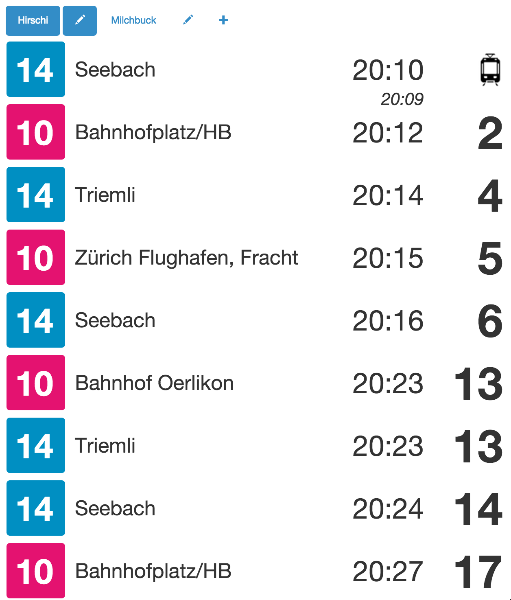

# Introduction

Tramboard is a station board for the trams and public transport in Switzerland. It is optimized to work for the city of Zurich and will indicate real-time information using the ZVV Mobile API. It will work as well for other towns in Switzerland but then the infos will not be real-time.

Here is a quick look:



# How to use

The tramboard is currently deployed on [http://tramboard.herokuapp.com](http://tramboard.herokuapp.com). The infos are stored in the local storage so you will have to re-create your views for each browser.

To get started, just create a view by clicking on the (+) icon. Indicate the name (which will be displayed in the tab), and the station. You can filter out the results by adding keywords (comma-separated). Only the connections whose last stop contains one of the keywords will then be displayed. It is case-insensitive. If no keywords are given, everything is displayed.

# How to install locally

You need to have [npm](http://npmjs.org) to run the app locally. Once you have that installed, just run:

```bash
node index.js
open http://localhost:8000
```

You can also use [gulp](http://gulpjs.com/) to run the app using [browser sync](http://www.browsersync.io/):

```bash
npm install --global gulp
gulp
```
